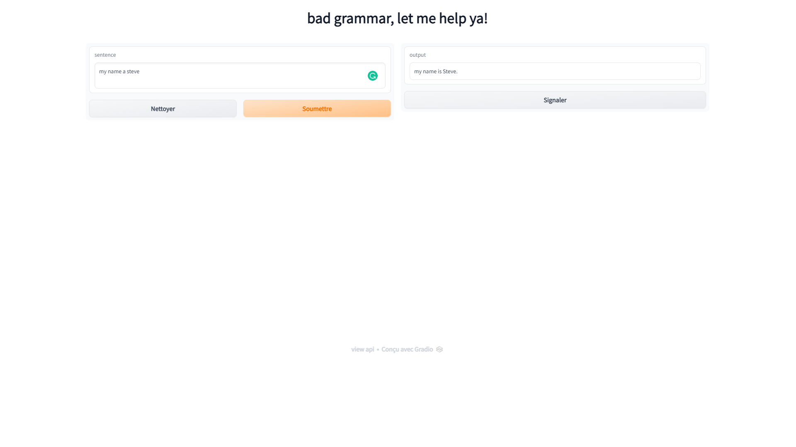

# GrammarCorrector as the name say it is used to correct mistakes
## This project was used with open source software
if you run the source code on your machine you should have the following results :

You have to input the text and next just type submit button
